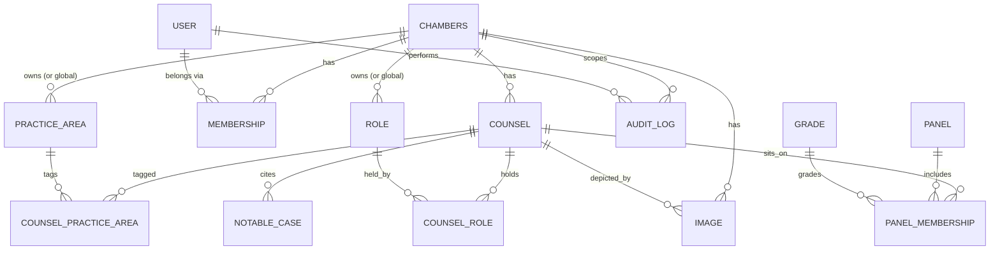

# 36 Crime Counsel Directory — Data Model

**Version:** 0.1 (Draft for review)
**Scope:** Logical data model for a production PostgreSQL database. Normalised to third normal form, designed for multi-chambers (multi-tenant) operation from day one.
**Deliberately excluded:** SQL DDL. Column *types* are named (PostgreSQL) because they are part of the model, but there are no `CREATE TABLE` statements.

---

## 0. Interpretation & assumptions

Resolved with the client:

- **"Roles"** → **professional roles / appointments** held by counsel — King's Counsel, Junior, Recorder, Deputy High Court Judge, Head of Chambers, etc. A member can hold several. *(Confirmed.)* User permissions remain a separate concept on the user's membership of a chambers (§4.3), so the word "role" never means two things at once.
- **"Grades"** → **CPS advocacy grades / panel levels** (Level 1–4 and any specialist gradings). These attach to a *panel membership*, not to the person in the abstract — a barrister can be Level 4 on one panel and unlisted on another.
- **Availability is out of scope.** The directory does not store or display availability. It cannot integrate with the chambers diary/practice-management system, and a manually-maintained status would only go stale — the exact failure of the spreadsheet. Clients enquire through the clerks, who hold the real diary. This removes PRD risk R1 entirely.
- Personal contact details for counsel are **not** modelled as client-visible fields; enquiries route to the clerking team (PRD decision D4).

---

## 1. Multi-chambers (tenancy) strategy — the frame everything sits in

Because supporting multiple chambers is a first-class requirement, tenancy is decided *before* the tables, since it shapes almost every one.

**Chosen approach: single shared schema, `chambers_id` on every tenant-owned row, isolation enforced by PostgreSQL Row-Level Security (RLS).**

Every tenant-owned table carries a `chambers_id` foreign key. RLS policies restrict each connection to its own chambers, so isolation is enforced at the database, not left to application discipline. Considered and rejected for now:

| Model | Isolation | Ops cost | Cross-tenant analytics | Verdict |
|-------|-----------|----------|------------------------|---------|
| **Shared schema + `chambers_id` + RLS** | Strong (DB-enforced) | Low | Trivial | **Chosen** |
| Schema-per-tenant | Stronger | Medium–high (migrations × N) | Awkward | Later, for a very large single tenant |
| Database-per-tenant | Strongest | High | Hard | Only if a client demands physical isolation |

Shared-schema + RLS is the standard SaaS choice at this scale (tens of chambers, low hundreds of counsel each): cheapest to run, one migration path, easy platform-wide reporting, and a clean extraction route later if one chambers ever needs its own database. Growth path and the global-vs-tenant lookup nuance are covered in §8.

---

## 2. Modelling conventions

Applied consistently across all tables:

- **Primary keys:** `uuid` (UUID v7 recommended — time-ordered, so index locality stays good and rows aren't enumerable across tenants).
- **Tenant key:** `chambers_id uuid` on every tenant-owned table; part of composite uniqueness and every RLS policy.
- **Timestamps:** `created_at timestamptz`, `updated_at timestamptz` (both `not null`, default now).
- **Provenance:** `created_by uuid`, `updated_by uuid` referencing `users`, on the tables clerks edit — so the audit trail is corroborated by the row itself.
- **Soft delete:** status fields or `archived_at`/`deleted_at` rather than hard deletes for records with history (counsel, images); lookups are *retired*, not deleted (matches the Taxonomy screen).
- **Uniqueness is tenant-scoped:** e.g. a counsel `slug` is unique *within* a chambers, not globally — via a composite unique `(chambers_id, slug)`.
- **Enumerations** are PostgreSQL `enum` types where the set is small and stable; a lookup table where clerks must edit the set.

---

## 3. Entity–relationship overview



Textual reading of the map: a **chambers** owns many **counsel**, **users** (via memberships), and content. A **counsel** connects to **practice areas** and **roles** through junction tables (many-to-many), sits on **panels** through **panel memberships** (a many-to-many carrying a **grade** and dates), and owns **notable cases** and **images** (one-to-many). **Audit logs** reference a **user** actor and any entity.

---

## 4. Tables

### 4.1 `chambers` — the tenant root
The organisation that owns everything else. One row per set (at MVP, one row).

- `id` uuid — PK
- `name` text — display name ("The 36 Group")
- `slug` text — unique, URL-safe tenant key
- `settings` jsonb — branding, feature flags, defaults (semi-structured on purpose; see §6)
- `status` enum(`active`,`suspended`) 
- `created_at`, `updated_at`

Constraints: `slug` globally unique (it identifies the tenant).

### 4.2 `users` — people who administer
Global identities (a person, not a per-chambers row), so one user can serve more than one chambers.

- `id` uuid — PK
- `email` text — globally unique (identity)
- `full_name` text
- `status` enum(`active`,`invited`,`disabled`)
- `last_login_at` timestamptz — nullable
- `created_at`, `updated_at`

Note: credentials/authentication live in the auth provider; this table is the application profile. It intentionally carries **no** `chambers_id` and **no** permission role — those belong on the membership.

### 4.3 `memberships` — user ↔ chambers, with permission
The associative table that makes users multi-chambers and holds their permission level. This is the RBAC join.

- `id` uuid — PK
- `user_id` uuid — FK → `users`
- `chambers_id` uuid — FK → `chambers`
- `role` enum(`platform_admin`,`chambers_admin`,`clerk`,`viewer`) — the permission level *within this chambers*
- `status` enum(`active`,`invited`,`revoked`)
- `created_at`, `updated_at`

Constraints: unique `(user_id, chambers_id)` — a user has one role per chambers. `platform_admin` is the cross-tenant operator role.

### 4.4 `counsel` — the core entity
One row per barrister. The record clients actually browse.

- `id` uuid — PK
- `chambers_id` uuid — FK → `chambers`
- `full_name` text
- `slug` text — profile URL segment
- `year_of_call` smallint — nullable until publish
- `practice_capacity` enum(`prosecution`,`defence`,`both`) — CPS clients filter on this
- `short_bio` text — nullable
- `status` enum(`draft`,`published`,`archived`) — publication state
- `display_order` int — nullable, for manual featuring
- `created_at`, `updated_at`, `created_by`, `updated_by`

Constraints: unique `(chambers_id, slug)`. Publishing is gated in the app on required fields (name, year_of_call, ≥1 practice area).

### 4.5 `practice_areas` — specialism vocabulary (lookup)
Editable controlled vocabulary (homicide, serious sexual offences, fraud & financial crime, drugs, regulatory, POCA…).

- `id` uuid — PK
- `chambers_id` uuid — FK → `chambers`, **nullable** (NULL = platform-standard, shared by all chambers; see §8)
- `name` text
- `slug` text
- `description` text — nullable
- `display_order` int
- `is_active` boolean — retire without deleting

Constraints: unique `(chambers_id, slug)` treating NULL as the global namespace.

### 4.6 `counsel_practice_areas` — junction (M:N)
Resolves the many-to-many between counsel and practice areas.

- `counsel_id` uuid — FK → `counsel`
- `practice_area_id` uuid — FK → `practice_areas`
- `is_primary` boolean — flags a headline specialism for card display
- PK: composite `(counsel_id, practice_area_id)`

### 4.7 `roles` — professional appointments (lookup)
KC, Junior, Recorder, Deputy High Court Judge, Head of Chambers, etc.

- `id` uuid — PK
- `chambers_id` uuid — FK → `chambers`, **nullable** (national titles like "King's Counsel" can be global)
- `name` text
- `abbreviation` text — nullable ("KC")
- `display_order` int
- `is_active` boolean

Constraints: unique `(chambers_id, slug/name)`.

### 4.8 `counsel_roles` — junction (M:N)
- `counsel_id` uuid — FK → `counsel`
- `role_id` uuid — FK → `roles`
- `since_year` smallint — nullable (e.g. year took silk)
- PK: composite `(counsel_id, role_id)`

### 4.9 `panels` — CPS panels (lookup)
The panel taxonomy: General Crime, RASSO, Serious Crime, Fraud, Proceeds of Crime, Counter-Terrorism, Extradition, etc.

- `id` uuid — PK
- `chambers_id` uuid — FK → `chambers`, **nullable** (CPS panels are national → recommended global; NULL)
- `name` text
- `type` enum(`general`,`specialist`)
- `issuing_body` text — default "CPS", allows future non-CPS panels
- `display_order` int
- `is_active` boolean

*(Confirm the exact live panel list against current CPS panel guidance before seeding.)*

### 4.10 `grades` — advocacy levels (lookup)
The CPS levels (Level 1–4) and any specialist gradings.

- `id` uuid — PK
- `chambers_id` uuid — FK → `chambers`, **nullable** (national → global)
- `name` text ("Level 4")
- `rank` smallint — numeric ordering for range filters and sorting (4 > 3 > 2 > 1)
- `is_active` boolean

Optional strictness: a `panel_grades` bridge (`panel_id`, `grade_id`) can constrain *which grades are valid for which panel* if you want the editor to prevent nonsensical pairings. Left out of the core to avoid over-engineering; note it as a §9 decision.

### 4.11 `panel_memberships` — the associative entity (M:N + attributes)
The richest relationship: a counsel sits on a panel, at a grade, for a period. This is what powers the flagship "Level 4 on the RASSO panel" filter.

- `id` uuid — PK
- `counsel_id` uuid — FK → `counsel`
- `panel_id` uuid — FK → `panels`
- `grade_id` uuid — FK → `grades`, **nullable** (some specialist panels are membership-only, no level)
- `date_admitted` date — nullable
- `date_expires` date — nullable (CPS panel appointments are time-limited)
- `status` enum(`active`,`lapsed`,`pending`)
- `created_at`, `updated_at`

Constraints: partial unique `(counsel_id, panel_id) where status = 'active'` — one active membership per panel, while allowing historical lapsed rows.

### 4.12 `notable_cases` — reported/notable work (1:M)
- `id` uuid — PK
- `counsel_id` uuid — FK → `counsel`
- `title` text
- `citation` text — nullable ("[2023] EWCA Crim 123")
- `year` smallint — nullable
- `court` text — nullable
- `role_in_case` text — nullable ("Leading junior, prosecution")
- `summary` text — nullable
- `is_published` boolean — a case can be hidden without deleting
- `display_order` int
- `created_at`, `updated_at`

### 4.13 `images` — headshots and assets (1:M)
- `id` uuid — PK
- `chambers_id` uuid — FK → `chambers`
- `counsel_id` uuid — FK → `counsel`, **nullable** (NULL = chambers-level asset such as a logo)
- `type` enum(`headshot`,`chambers_logo`,`other`)
- `storage_key` text — object-storage path (files live in storage, not the DB)
- `alt_text` text — nullable (accessibility)
- `width` int, `height` int, `mime_type` text, `checksum` text
- `is_primary` boolean — the displayed headshot
- `created_at`, `created_by`

Constraints: partial unique `(counsel_id) where is_primary = true and type = 'headshot'` — exactly one primary headshot per counsel. *(Design note: an explicit `counsel_id` + `chambers_id` is used rather than a polymorphic owner to keep foreign keys enforceable; if more owner types appear later, a polymorphic `owner_type`/`owner_id` is the alternative — see §9.)*

### 4.14 `audit_logs` — append-only history
Records every consequential change for accountability (PRD risk R2).

- `id` uuid — PK
- `chambers_id` uuid — FK → `chambers`, **nullable** (platform-level events)
- `actor_user_id` uuid — FK → `users`, **nullable** (system actions have no user; `on delete set null` preserves the record)
- `action` enum(`create`,`update`,`delete`,`publish`,`unpublish`,`login`,`access_grant`,`access_revoke`)
- `entity_type` text — the affected table ("counsel", "panel_membership"…)
- `entity_id` uuid — the affected row (not an enforced FK — audit must outlive the row it describes)
- `changes` jsonb — before/after diff
- `ip_address` inet — nullable
- `user_agent` text — nullable
- `occurred_at` timestamptz

Append-only by convention: no updates or deletes.

### 4.15 `client_access` — *(adjacent, not in your list; noted for completeness)*
Supports the gated portal (PRD decision D1). `id`, `chambers_id`, `label`, `method`, `issued_at`, `revoked_at`, `last_used_at`. Include once D1 is settled.

---

## 5. Every relationship, explained

Each foreign key, its cardinality, and its delete behaviour.

1. **chambers → counsel** — one-to-many. A chambers has many counsel; each counsel belongs to exactly one chambers. `chambers_id` on `counsel`. On delete: **restrict** (a chambers is suspended/soft-deleted, never hard-deleted out from under its data).
2. **chambers → memberships** and **users → memberships** — two one-to-many relationships that together make `memberships` a many-to-many between users and chambers. A user can administer several chambers; a chambers has several users. On delete: **cascade** from either side (removing the link, not the user or chambers).
3. **chambers → practice_areas / roles / panels / grades** — one-to-many, but `chambers_id` is **nullable**: a NULL means a platform-standard row shared by all chambers (§8). On delete: **restrict** (retire, don't delete, since counsel reference them).
4. **counsel ↔ practice_areas** via **counsel_practice_areas** — many-to-many. A counsel has many specialisms; a specialism is held by many counsel. On delete: **cascade** on the counsel side (remove the counsel's tags), **restrict** on the practice-area side (can't delete an in-use area — retire it).
5. **counsel ↔ roles** via **counsel_roles** — many-to-many, same delete rules as (4).
6. **counsel ↔ panels** via **panel_memberships** — many-to-many *with attributes* (grade, dates, status). This associative entity is the reason panels and grades are separate tables: the grade belongs to the *relationship*, not to the counsel or the panel alone. On delete: **cascade** from counsel; **restrict** from panel.
7. **grades → panel_memberships** — one-to-many. A grade classifies many memberships; a membership has at most one grade (`grade_id` nullable). On delete: **restrict** (a grade in use can't be deleted).
8. **counsel → notable_cases** — one-to-many. Cases belong to one counsel. On delete: **cascade** (a counsel's cases go with them).
9. **counsel → images** — one-to-many, with a partial-unique guaranteeing a single primary headshot. On delete: **cascade** (and the stored files are cleaned up by the app/storage lifecycle).
10. **chambers → images** — one-to-many, for chambers-level assets (logo) where `counsel_id` is NULL.
11. **users → audit_logs** (`actor_user_id`) — one-to-many. On delete: **set null** — deleting a user must never erase the history of what they did.
12. **chambers → audit_logs** — one-to-many; nullable for platform-level events.
13. **audit_logs → any entity** (`entity_type` + `entity_id`) — a *soft* reference, deliberately **not** an enforced foreign key, because an audit record must survive the deletion of the thing it describes.

---

## 6. Normalisation

The model is in **third normal form**, with two deliberate, documented exceptions.

- **1NF** — no repeating groups or multi-valued columns. A counsel's several specialisms, roles and panels are rows in junction tables, never comma-separated fields.
- **2NF** — no partial dependencies. All junctions use composite keys where every non-key attribute depends on the whole key (e.g. `is_primary` in `counsel_practice_areas` depends on the specific counsel-area pair).
- **3NF** — no transitive dependencies. Descriptive data that would otherwise repeat (panel names, grade names, role titles, practice-area labels) is extracted into lookup tables and referenced by id, so a rename happens in exactly one place.

**Deliberate denormalisation, justified:**
- `settings` (chambers) and `changes` (audit) use `jsonb`. This is intentional: branding/feature flags and audit diffs are genuinely schemaless and would be noise as columns. Structured data that is queried or filtered is never hidden in JSON.
- `display_order` columns cache a manual ordering rather than deriving it — a pragmatic, standard choice for editor-controlled sequencing.

---

## 7. Indexing & performance

The directory's read pattern is narrow and predictable, so indexing is straightforward.

- Every foreign key is indexed (Postgres does not do this automatically).
- **Directory query index:** composite on `counsel (chambers_id, status)` — the base filter for "published counsel in this chambers."
- **Search:** a `pg_trgm` GIN index across name / specialism / notable-case text if any search runs server-side. *(In practice, per the architecture, the small published set is shipped to the browser and filtered in-memory — so these indexes mainly serve admin and the payload build, not per-keystroke queries.)*
- **Panel filter:** index `panel_memberships (panel_id, grade_id, status)` to resolve "Level 4 on RASSO" quickly.
- **Audit:** index `audit_logs (chambers_id, occurred_at desc)` and `(entity_type, entity_id)`.

---

## 8. Scalability to multiple chambers — deeper notes

- **Global vs tenant lookups.** National standards — CPS **panels** and **grades** — are best modelled as **global** rows (`chambers_id = NULL`) so every chambers shares one correct, centrally-maintained taxonomy and a platform update propagates everywhere. Chambers-specific vocabulary — how a set labels its **practice areas**, its internal **roles** — is tenant-scoped. The nullable `chambers_id` on lookups supports both in one table, and uniqueness treats NULL as the global namespace. A chambers can also be allowed to *add* its own rows alongside the globals.
- **Isolation.** RLS policies key on the session's chambers, so application bugs can't leak one set's data to another. `platform_admin` memberships bypass tenant scoping for support/operations.
- **Users across chambers.** The `memberships` join means a shared clerking team, or a platform operator, can hold roles in several chambers without duplicate accounts.
- **Even growth.** UUID v7 keys keep inserts index-friendly and prevent cross-tenant id enumeration.
- **Extraction path.** If one chambers ever outgrows the shared database, the consistent `chambers_id` scoping means its rows can be lifted into a dedicated schema or database with a filtered export — the model doesn't have to change to get there.
- **Extensibility hooks.** `settings jsonb` on chambers, soft-delete everywhere, and `created_by`/`updated_by` provenance mean new features and per-tenant configuration rarely require schema surgery.

---

## 9. Open decisions to confirm

- **D-DM1** — ~~Roles: professional appointments or user-permission roles?~~ **Resolved — professional appointments.**
- **D-DM2** — Should CPS panels/grades be global (recommended) or per-chambers copies?
- **D-DM3** — Do you want the strict `panel_grades` validity bridge (§4.10), or is app-level validation enough?
- **D-DM4** — Confirm the live CPS panel and grade lists before seeding the lookups.
- **D-DM5** — Client access model (PRD D1) — determines whether `client_access` (§4.15) joins the core schema now.
- **D-DM6** — Retention/consent position for counsel PII and headshots (PRD risk R3), which may add retention fields.
```
